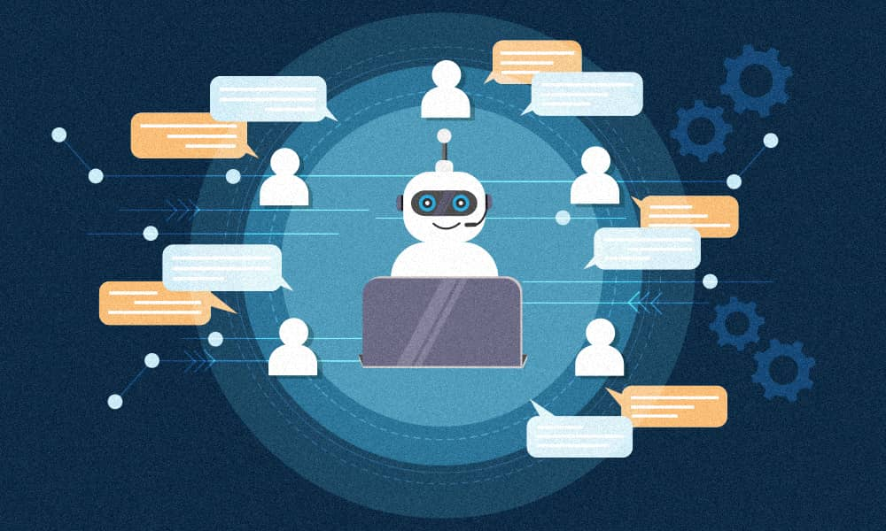

# <div align="center">Chatbot with Retrieval Augmented Generation (RAG) and Fine-tuned Language Model</div>

<div align="center">
  
</div>

This project provides a chatbot powered by Retrieval Augmented Generation (RAG) and a quantized, LoRA fine-tuned language model. The chatbot utilizes a pre-trained language model (currently Mistral-7B-Instruct-v0.3) fine-tuned using LoRA and quantization on the same data used for RAG and a vector database (Chroma) to retrieve relevant information from a collection of documents. The API inference is handled serverlessly, enabling efficient scaling and resource management.

**Features:**

* **RAG-based Chatbot:** The chatbot uses RAG to provide informative and relevant answers based on the provided documents.
* **Document Retrieval:** The vector database efficiently retrieves documents most relevant to the user's query.
* **Quantized, LoRA Fine-tuned Language Model:** A pre-trained language model is fine-tuned using LoRA (Low-Rank Adaptation) and quantization, resulting in a smaller, more efficient model with improved performance on the specific domain.
* **User-Friendly Interface:** A simple web interface allows users to interact with the chatbot.

**RAG vs. Fine-Tuning Comparison:**

This project combines both RAG and fine-tuning to enhance the chatbot's capabilities. Here's a comparison of their strengths and weaknesses:

**RAG (Retrieval Augmented Generation):**

* **Strengths:**
    * **Access to a wider knowledge base:** RAG can access information from a large corpus of documents, providing broader context for answering questions.
    * **Flexibility:** The chatbot can adapt to new information by updating the document collection.
* **Weaknesses:**
    * **May not capture nuanced domain knowledge:** The language model may not fully understand the specific context or terminology present in the documents.
    * **Potential for irrelevant or incomplete answers:** If the retrieved documents are not relevant or complete, the chatbot's response may be inaccurate.

**Fine-Tuning:**

* **Strengths:**
    * **Specialized knowledge:** Fine-tuning the model on the same data used for RAG helps it learn domain-specific vocabulary and concepts.
    * **Improved accuracy:** The fine-tuned model can generate more accurate and relevant answers within the specific domain.
* **Weaknesses:**
    * **Limited to the training data:** The model's knowledge is restricted to the data it was trained on.
    * **Potential for bias:** The fine-tuned model may inherit biases from the training data.

**Combining RAG and Fine-Tuning:**

By combining RAG and fine-tuning, the chatbot benefits from:

* **Broad knowledge base:** Access to a wider range of information through RAG.
* **Specialized understanding:** Improved accuracy and relevance within the specific domain through fine-tuning.


**Project Structure:**

```
├── app.py            : Main Flask application for chatbot functionality
├── chat.html         : HTML template for the chatbot interface
├── database.py       : Script for loading and embedding documents into Chroma
├── query.py          : Script for querying the RAG system and formatting responses
├── chroma            : Directory to store Chroma database data
```

**Prerequisites:**

* Python 3.7+
* Flask
* Transformers
* Langchain
* Langchain_community
* PyMongo
* SentenceTransformers
* Hugging Face API Key (for accessing Mistral-7B-Instruct-v0.3)
* MongoDB (for storing documents)
* Serverless platform 

**Setup:**

1. **Install dependencies:**
   ```bash
   pip install -r requirements.txt
   ```

2. **Set up MongoDB:**
   * Install MongoDB if not already installed.
   * Create a database named `Metadata_FSTT` and collections as defined in `database.py`.
   * Populate the collections with relevant documents.

3. **Configure API Key:**
   * Obtain a Hugging Face API key from [https://huggingface.co/settings/tokens](https://huggingface.co/settings/tokens).
   * Set the `hf_auth` variable in `app.py` to your API key.
   * Api inference serverless

4. **Run the application:**
   ```bash
   python app.py
   ```

**Usage:**

1. Open the chatbot interface at `http://127.0.0.1:5000/`.
2. Type your questions in the chat box.
3. The chatbot will respond based on the retrieved documents and the knowledge of the language model.

**Notes:**

* The `chroma` directory will be created automatically when the application runs.
* The `database.py` script will populate the Chroma database with documents from the MongoDB collections.
* You can customize the document sources and the language model used in the project.
* The chatbot's performance depends on the quality and relevance of the documents provided.

**Contribution:**

Contributions are welcome! Feel free to open issues or submit pull requests.

**License:**

This project is licensed under the MIT License.
```
